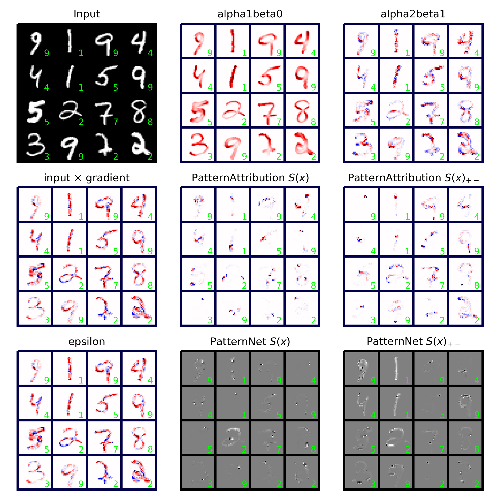

# Implementation of LRP for pytorch
A simple PyTorch implementation of the most basic Layer-Wise Relevance
Propagation rules [1, 2] for linear layers and convolutional layers.

The modules simply decorates `torch.nn.Sequential`, `torch.nn.Linear`, and
`torch.nn.Conv2d` to be able to use `autograd` backprop algorithm to compute
explanations.

## Installation
To install requirements, refer to the [`requirements.yml`](requirements.yml)
file.

If you use `conda`, then you can install an environment called `torchlrp` by
executing the following command: 

```bash
> conda env create -f requirements.yml
```

To be able to import `lrp` as below, make sure that the `TorchLRP` directory is
included in your path.

## Usage 
The code can be used as follows:

```python 
import torch
import lrp

model = Sequential(
    lrp.Conv2d(1, 32, 3, 1, 1),
    torch.nn.ReLU(),
    torch.nn.MaxPool2d(2, 2),
    torch.nn.Flatten(),
    lrp.Linear(14*14*32, 10)
)

y_hat = model.forward(x, explain=True, rule="alpha2beta1")
y_hat = y_hat[torch.arange(batch_size), y_hat.max(1)[1]] # Choose maximizing output neuron
y_hat = y_hat.sum()

# Backward pass (do explanation)
y_hat.backward()
explanation = x.grad
```

**Implemented rules:**
|Rule 							|Key 					| Note 												|
|:------------------------------|:----------------------|:--------------------------------------------------|
|epsilon-rule					| "epsilon" 			| Implemented but epsilon fixed to `1e-1` 			|
|gamma-rule						| "gamma" 				| Implemented but gamma fixed to `1e-1`				|
|epsilon-rule					| "epsilon" 			| gamma and epsilon fixed to `1e-1`					|
|alpha=1 beta=0 				| "alpha1beta0" 		| 													|
|alpha=2 beta=1 				| "alpha2beta1" 		| 													|
|PatternAttribution (all) 		| "patternattribution" 	| Use additional argument `pattern=patterns_all` 	|
|PatternAttribution (positive) 	| "patternattribution" 	| Use additional argument `pattern=patterns_pos` 	|
|PatternNet (all) 				| "patternnet" 			| Use additional argument `pattern=patterns_all` 	|
|PatternNet (positive) 			| "patternnet" 			| Use additional argument `pattern=patterns_pos` 	|

To compute patterns for the two `PatternAttribution` methods, import
`lrp.patterns` and call
```python 
import lrp.patterns.*
patterns_all = fit_patternnet(model, train_loader)
patterns_pos = fit_patternnet_positive(model, train_loader)
```

_Note:_ Biases are currently ignored in the alphabeta-rule implementations.

For a complete running example, which generates this plot: 


Please see [examples/explain_mnist.py](examples/explain_mnist.py).

## Possible bugs
Judging from the plot, something is probably wrong with the positive
PatternAttribution and PatternNet, as it doesn't compare visually to, e.g.,
[this implementation](https://github.com/albermax/innvestigate/blob/master/examples/notebooks/mnist_compare_methods.ipynb).


## References
[1] Bach, S., Binder, A., Montavon, G., Klauschen, F., Müller, K.R. and Samek, W., 2015. On pixel-wise explanations for non-linear classifier decisions by layer-wise relevance propagation. PloS one, 10(7), p.e0130140.
[2] Kindermans, P.J., Schütt, K.T., Alber, M., Müller, K.R., Erhan, D., Kim, B. and Dähne, S., 2017. Learning how to explain neural networks: Patternnet and patternattribution. arXiv preprint arXiv:1705.05598.
