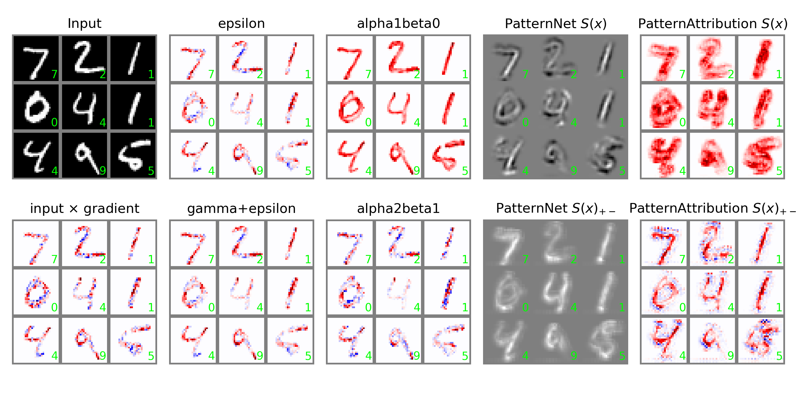

# Implementation of LRP for pytorch
PyTorch implementation of some of the Layer-Wise Relevance Propagation (LRP)
rules, [1, 2, 3], for linear layers and convolutional layers.

The modules decorates `torch.nn.Sequential`, `torch.nn.Linear`, and
`torch.nn.Conv2d` to be able to use `autograd` backprop algorithm to compute
explanations.

## Installation
To install requirements, refer to the [`requirements.yml`](requirements.yml)
file.

If you use `conda`, then you can install an environment called `torchlrp` by
executing the following command: 

```bash
> conda env create -f requirements.yml
```

To be able to import `lrp` as below, make sure that the `TorchLRP` directory is
included in your path.

## Usage 

The code can be used as follows:

```python 
import torch
import lrp

model = Sequential(
    lrp.Conv2d(1, 32, 3, 1, 1),
    torch.nn.ReLU(),
    torch.nn.MaxPool2d(2, 2),
    torch.nn.Flatten(),
    lrp.Linear(14*14*32, 10)
)

x = ... # business as usual
y_hat = model.forward(x, explain=True, rule="alpha2beta1")
y_hat = y_hat[torch.arange(batch_size), y_hat.max(1)[1]] # Choose maximizing output neuron
y_hat = y_hat.sum()

# Backward pass (do explanation)
y_hat.backward()
explanation = x.grad
```


**Implemented rules:**
|Rule 							|Key 					| Note 												|
|:------------------------------|:----------------------|:--------------------------------------------------|
|epsilon-rule					| "epsilon" 			| Implemented but epsilon fixed to `1e-1` 			|
|gamma-rule						| "gamma" 				| Implemented but gamma fixed to `1e-1`				|
|epsilon-rule					| "epsilon" 			| gamma and epsilon fixed to `1e-1`					|
|alpha=1 beta=0 				| "alpha1beta0" 		| 													|
|alpha=2 beta=1 				| "alpha2beta1" 		| 													|
|PatternAttribution (all) 		| "patternattribution" 	| Use additional argument `pattern=patterns_all` 	|
|PatternAttribution (positive) 	| "patternattribution" 	| Use additional argument `pattern=patterns_pos` 	|
|PatternNet (all) 				| "patternnet" 			| Use additional argument `pattern=patterns_all` 	|
|PatternNet (positive) 			| "patternnet" 			| Use additional argument `pattern=patterns_pos` 	|

To compute patterns for the two `PatternAttribution` methods, import
`lrp.patterns` and call
```python 
import lrp.patterns.*
patterns_all = fit_patternnet(model, train_loader)
patterns_pos = fit_patternnet_positive(model, train_loader)
```

_Note:_ Biases are currently ignored in the alphabeta-rule implementations.


### Trace intermediate relevances
Thanks to [francescomalandrino](https://github.com/francescomalandrino), you can now also
trace the intermediate relevances by enabling traces:

```python
... 
lrp.trace.enable_and_clean()
y_hat.backward()
all_relevances=lrp.trace.collect_and_disable()

for i,t in enumerate(all_relevances):
    print(i,t.shape)
```

## MNIST
For a complete running example, please see [examples/explain_mnist.py](examples/explain_mnist.py).
The code generates this plot: 


To run the example code, simply activate the conda environment and execute the code from the root of the project:
```bash
> conda activate torchlrp
> python examples/explain_mnist.py
```

## VGG / ImageNet
It is also possible to use this code for pretrained vgg models from `torchvision`,
by using the `lrp.convert_vgg` function to convert `torch.nn.Conv2d` and `torch.nn.Linear` layers to `lrp.Conv2d` and `lrp.Linear`, respectively. 


It takes a bit to make the vgg example work. First, you need An imagenet dataloader.
In the code, we use the dataloader from the [torch_imagenet](https://github.com/fhvilshoj/torch_imagenet) repo.
You could also make your own. 

The most interesting parts is converting the torch vgg models, such that they can be
explained. To do so, do as follows:

```python 
vgg = torchvision.models.vgg16(pretrained=True).to(device)
vgg.eval()
lrp_vgg = lrp.convert_vgg(vgg).to(device)
```

The `lrp_vgg` model will then have the same parameters as the original network.
Afterwards, explanations can be produced as the example above.

#### Note:
The code example reads a `config.ini` file from the root of this project. In 
that file you can specify the parent of the `torch_imagenet` repo such that the
correct dataloader is loaded:

```config
[DEFAULT]
ImageNetDir = /home/user/example/data
```

## Possible bugs
**Fixed** - Description
- [ ] According to [3] Section 10.3.2, it is apparently a good idea to use gradient of average pooling for LRP backpropagation. I have started to implement this but not finished, as I didn't need it so far.

- [x] _Fixed in `commit 4277098f4f37a81ae9a21154c8cba49cae918770`__. Judging
  from the plot, something is probably wrong with the positive
  PatternAttribution and PatternNet, as it doesn't compare visually to, e.g.,
  [this implementation](https://github.com/albermax/innvestigate/blob/master/examples/notebooks/mnist_compare_methods.ipynb).


## References
[1] Bach, S., Binder, A., Montavon, G., Klauschen, F., Müller, K.R. and Samek, W., 2015. On pixel-wise explanations for non-linear classifier decisions by layer-wise relevance propagation. PloS one, 10(7), p.e0130140.  
[2] Kindermans, P.J., Schütt, K.T., Alber, M., Müller, K.R., Erhan, D., Kim, B. and Dähne, S., 2017. Learning how to explain neural networks: Patternnet and patternattribution. arXiv preprint arXiv:1705.05598.  
[3] Montavon, G., Binder, A., Lapuschkin, S., Samek, W. and Müller, K.R., 2019. Layer-wise relevance propagation: an overview. In Explainable AI: interpreting, explaining and visualizing deep learning (pp. 193-209). Springer, Cham.  
